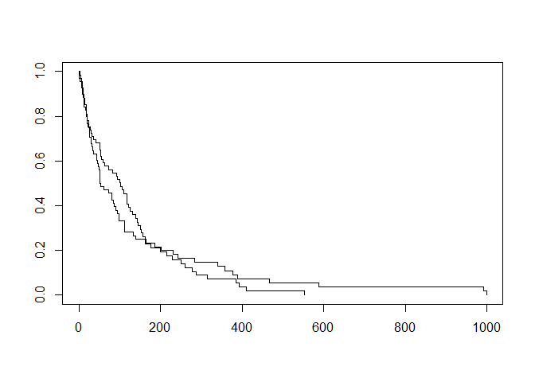
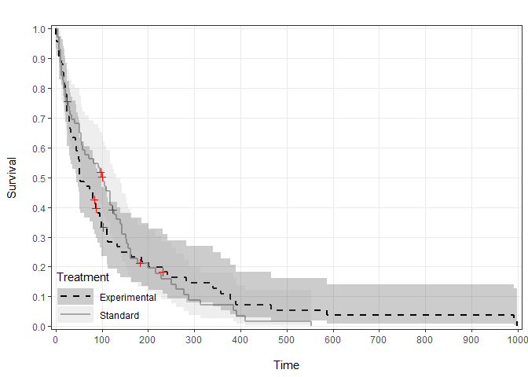
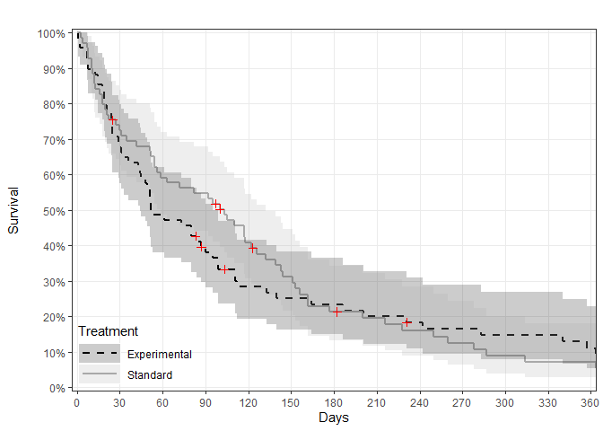
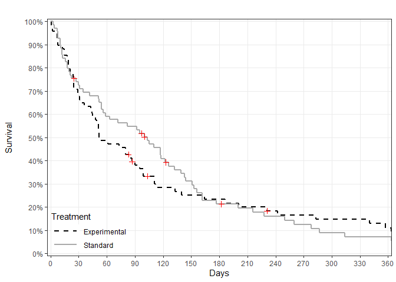
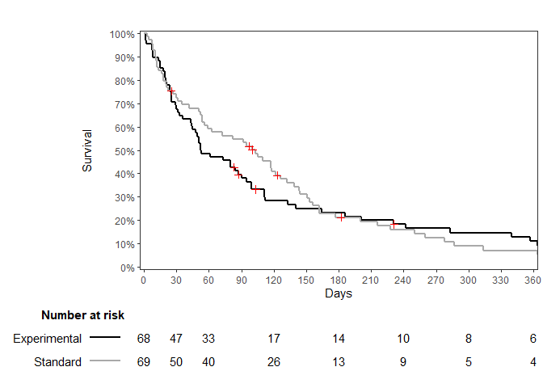

nicesurv examples
================
Lisa Rein
2019-07-26

### Install packages

``` r
rm(list =ls())

options(knitr.kable.NA = '.')

packs <- c("knitr"
           ,"survival"
           ,"devtools"
           ,"ggplot2"
           ,"htmlTable"
           ,"pammtools"
           )

install <- lapply(packs, function(x) require(x, character.only = T))

install_github("lisaerein/nicesurv")

library(nicesurv)

help(ggsurv)
```

### Load the *veteran* dataset from the survival R package

``` r
data(veteran)

head(veteran)
```

    ##   trt celltype time status karno diagtime age prior
    ## 1   1 squamous   72      1    60        7  69     0
    ## 2   1 squamous  411      1    70        5  64    10
    ## 3   1 squamous  228      1    60        3  38     0
    ## 4   1 squamous  126      1    60        9  63    10
    ## 5   1 squamous  118      1    70       11  65    10
    ## 6   1 squamous   10      1    20        5  49     0

### Generate survival estimates using the survfit function

``` r
mysfit <- survfit(Surv(time, status) ~ trt, data = veteran)

plot(mysfit)
```

<!-- -->

### Generate a default ggsurv KM plot

``` r
ggsurv(sfit = mysfit)
```

<!-- -->

### Add ggsurv optional parameters:

#### Label and reorder groups, change colors and line types

``` r
ggsurv(sfit = mysfit,
       grname = "Treatment",
       groups = c(2,1),
       grlabs = c("Experimental", "Standard"),
       surv.col = c("black", "darkgray"),
       surv.lty = c(2,1))
```

<!-- -->

#### Change the x axis limits/breaks to show 1 year and change y axis to percentage scale

``` r
ggsurv(sfit = mysfit,
       grname = "Treatment",
       groups = c(2,1),
       grlabs = c("Experimental", "Standard"),
       surv.col = c("black", "darkgray"),
       surv.lty = c(2,1),
       xlab = c("Days"),
       xlim = c(0, 360),
       xby = 30,
       perc = TRUE)
```

<!-- -->

#### Remove 95% CI shading

``` r
ggsurv(sfit = mysfit,
       grname = "Treatment",
       groups = c(2,1),
       grlabs = c("Experimental", "Standard"),
       surv.col = c("black", "darkgray"),
       surv.lty = c(2,1),
       xlab = c("Days"),
       xlim = c(0, 360),
       xby = 30,
       perc = TRUE,
       ci = FALSE)
```

<!-- -->

#### Add a risk table

``` r
ggsurv(sfit = mysfit,
       grname = "Treatment",
       groups = c(2,1),
       grlabs = c("Experimental", "Standard"),
       surv.col = c("black", "darkgray"),
       surv.lty = c(1,1),
       xlab = c("Days"),
       xlim = c(0, 360),
       xby = 30,
       perc = TRUE,
       ci = FALSE,
       grid = FALSE,
       risktab = TRUE,
       risktab.margins = c(0,0.01,0.2,0.15),
       risktab.times = c(0,30,60,120,180,240,300,360))
```

<!-- -->

#### Create a non-stratified survival curve with risk table

``` r
mysfit2 <- survfit(Surv(time, status) ~ 1, data= veteran)

ggsurv(sfit = mysfit2,
       grid = c(FALSE, TRUE),
       ci.ribbon = FALSE,
       ci.lty = 2,
       ci.size = 0.5,
       cens = FALSE,
       xlab = "\nMonths",
       xlim = c(0,3)*360,
       xby = 90,
       xbrlabs = seq(0,36,3),
       risktab = T,
       risktab.margins = c(0,0.01,0.2,0.15),
       risktab.times = seq(0,360*3,90))
```

<!-- -->

### Other functions in the ‘nicesurv’ R package

### ‘medtable’ generates a table for median survival estimates

``` r
mt <- medtab(mysfit,
             printorig = FALSE)
```

| Group | Median |      95% CI       |
| :---- | :----: | :---------------: |
| 1     | 103.00 | \[59.00, 132.00\] |
| 2     | 52.50  | \[44.00, 95.00\]  |

``` r
mt <- medtab(mysfit,
             groups = c(2,1),
             grlabs = c("Experimental", "Standard"),
             printorig = FALSE)
```

| Group        | Median |      95% CI       |
| :----------- | :----: | :---------------: |
| Experimental | 52.50  | \[44.00, 95.00\]  |
| Standard     | 103.00 | \[59.00, 132.00\] |

### ‘survtab’ generates a table of survival estimates

``` r
st <- survtab(mysfit,
              times = c(0,30,120,360,500),
              surv.dec = 2,
              groups = c(1,2),
              grlabs = c("Std.", "Exp."),
              printorig = FALSE)
```

| Time        |      Survival       | N events | N at risk |
| :---------- | :-----------------: | -------: | --------: |
| <b>Std.<b/> |          .          |        . |         . |
| 0           | 1.00 \[1.00, 1.00\] |        0 |        69 |
| 30          | 0.72 \[0.63, 0.84\] |       19 |        50 |
| 120         | 0.41 \[0.31, 0.54\] |       21 |        26 |
| 360         | 0.07 \[0.03, 0.18\] |       20 |         4 |
| 500         | 0.02 \[0.00, 0.12\] |        3 |         1 |
| <b>Exp.<b/> |          .          |        . |         . |
| 0           | 1.00 \[1.00, 1.00\] |        0 |        68 |
| 30          | 0.68 \[0.57, 0.80\] |       22 |        47 |
| 120         | 0.28 \[0.19, 0.42\] |       26 |        17 |
| 360         | 0.11 \[0.05, 0.23\] |       10 |         6 |
| 500         | 0.05 \[0.02, 0.16\] |        3 |         3 |

### ‘nicecoxph’ formats regression results from coxph models

#### Multiple regression

``` r
coxmod <- coxph(Surv(time, status) ~ trt + celltype + karno, data= veteran)

coxtbl <- nicecoxph(coxmod)
```

| Variable               | aHR  |     95% CI     |  p-value |
| :--------------------- | :--: | :------------: | -------: |
| <b>trt<b/>             | 1.30 | \[0.88, 1.93\] |    0.193 |
| <b>celltype<b/>        |  .   |       .        |        . |
| Smallcell vs. Squamous | 2.28 | \[1.35, 3.87\] |    0.002 |
| Adeno vs. Squamous     | 3.17 | \[1.78, 5.65\] | \< 0.001 |
| Large vs. Squamous     | 1.48 | \[0.85, 2.58\] |    0.162 |
| <b>karno<b/>           | 0.97 | \[0.96, 0.98\] | \< 0.001 |

Multiple CoxPH Regression, N = 137, Events = 128

#### Univariate regression

``` r
coxmod <- coxph(Surv(time, status) ~ trt + celltype + karno, data= veteran)

coxtbl <- nicecoxph(df = veteran,
                    covs = c("trt", "celltype", "karno"),
                    ttevent = "time",
                    event = "status",
                    type3 = TRUE,
                    regtype = "uni")
```

| Variable                                |  HR  |     95% CI     | Wald p-value | Type III p |
| :-------------------------------------- | :--: | :------------: | -----------: | ---------: |
| <b>trt (N = 137, Events = 128)<b/>      | 1.02 | \[0.71, 1.45\] |        0.928 |      0.928 |
| <b>celltype (N = 137, Events = 128)<b/> |  .   |       .        |            . |   \< 0.001 |
| Smallcell vs. Squamous                  | 2.71 | \[1.65, 4.45\] |     \< 0.001 |          . |
| Adeno vs. Squamous                      | 3.13 | \[1.76, 5.56\] |     \< 0.001 |          . |
| Large vs. Squamous                      | 1.26 | \[0.73, 2.17\] |        0.407 |          . |
| <b>karno (N = 137, Events = 128)<b/>    | 0.97 | \[0.96, 0.98\] |     \< 0.001 |   \< 0.001 |
