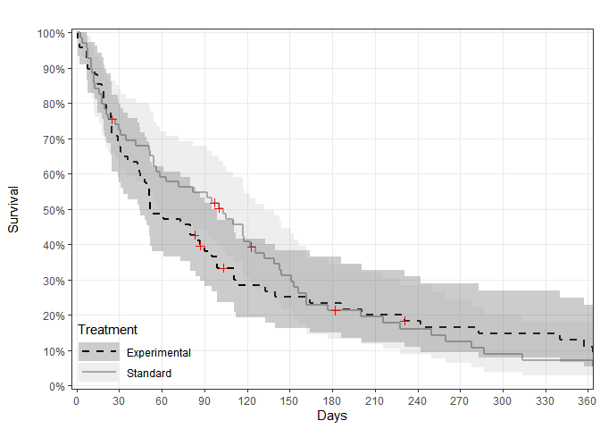

nicesurv examples
================
Lisa Rein
2019-06-12

### Install packages

``` r
packs <- c("knitr"
           ,"survival"
           ,"devtools"
           ,"ggplot2"
           ,"htmlTable"
           ,"pammtools"
           )

install <- lapply(packs, function(x) require(x, character.only = T))

install_github("lisaerein/nicesurv")

library(nicesurv)

help(ggsurv)
```

### Load the *veteran* dataset from the survival R package

``` r
data(veteran)

head(veteran)
```

    ##   trt celltype time status karno diagtime age prior
    ## 1   1 squamous   72      1    60        7  69     0
    ## 2   1 squamous  411      1    70        5  64    10
    ## 3   1 squamous  228      1    60        3  38     0
    ## 4   1 squamous  126      1    60        9  63    10
    ## 5   1 squamous  118      1    70       11  65    10
    ## 6   1 squamous   10      1    20        5  49     0

### Generate survival estimates using the survfit function

``` r
mysfit <- survfit(Surv(time, status) ~ trt, data = veteran)

plot(mysfit)
```


### Generate a default ggsurv KM plot

``` r
ggsurv(sfit = mysfit)
```


### Add ggsurv optional parameters:

#### Label and reorder groups, change colors and line types

``` r
ggsurv(sfit = mysfit,
       grname = "Treatment",
       groups = c(2,1),
       grlabs = c("Experimental", "Standard"),
       surv.col = c("black", "darkgray"),
       surv.lty = c(2,1))
```


#### Change the x axis limits/breaks to show 1 year and change y axis to percentage scale

``` r
ggsurv(sfit = mysfit,
       grname = "Treatment",
       groups = c(2,1),
       grlabs = c("Experimental", "Standard"),
       surv.col = c("black", "darkgray"),
       surv.lty = c(2,1),
       xlab = c("Days"),
       xlim = c(0, 360),
       xby = 30,
       perc = TRUE)
```



#### Remove 95% CI shading

``` r
ggsurv(sfit = mysfit,
       grname = "Treatment",
       groups = c(2,1),
       grlabs = c("Experimental", "Standard"),
       surv.col = c("black", "darkgray"),
       surv.lty = c(2,1),
       xlab = c("Days"),
       xlim = c(0, 360),
       xby = 30,
       perc = TRUE,
       ci = FALSE)
```


#### Add a risk table

``` r
ggsurv(sfit = mysfit,
       grname = "Treatment",
       groups = c(2,1),
       grlabs = c("Experimental", "Standard"),
       surv.col = c("black", "darkgray"),
       surv.lty = c(1,1),
       xlab = c("Days"),
       xlim = c(0, 360),
       xby = 30,
       perc = TRUE,
       ci = FALSE,
       grid = FALSE,
       risktab = TRUE,
       risktab.margins = c(0,0.01,0.2,0.15),
       risktab.times = c(0,30,60,120,180,240,300,360))
```


#### Create a non-stratified survival curve with risk table

``` r
mysfit2 <- survfit(Surv(time, status) ~ 1, data= veteran)

ggsurv(sfit = mysfit2,
       grid = c(FALSE, TRUE),
       ci.ribbon = FALSE,
       ci.lty = 2,
       ci.size = 0.5,
       cens = FALSE,
       xlab = "\nMonths",
       xlim = c(0,3)*360,
       xby = 90,
       xbrlabs = seq(0,36,3),
       risktab = T,
       risktab.margins = c(0,0.01,0.2,0.15),
       risktab.times = seq(0,360*3,90))
```


### Other functions in the 'nicesurv' R package

### 'medtable' generates a table for median survival estimates

``` r
mt <- medtab(mysfit,
             printorig = FALSE)
```

<table class="gmisc_table" style="border-collapse: collapse; margin-top: 1em; margin-bottom: 1em;">
<thead>
<tr>
<th style="border-top: 2px solid grey;">
</th>
<th colspan="2" style="font-weight: 900; border-bottom: 1px solid grey; border-top: 2px solid grey; text-align: center;">
Median survival time
</th>
</tr>
<tr>
<th style="font-weight: 900; border-bottom: 1px solid grey; text-align: center;">
Group
</th>
<th style="border-bottom: 1px solid grey; text-align: center;">
Median
</th>
<th style="border-bottom: 1px solid grey; text-align: center;">
95% CI
</th>
</tr>
</thead>
<tbody>
<tr>
<td style="text-align: left;">
1
</td>
<td style="padding-left: 1em; padding-right: 1em; text-align: center;">
103.00
</td>
<td style="padding-left: 1em; padding-right: 1em; text-align: center;">
\[59.00, 132.00\]
</td>
</tr>
<tr>
<td style="border-bottom: 2px solid grey; text-align: left;">
2
</td>
<td style="padding-left: 1em; padding-right: 1em; border-bottom: 2px solid grey; text-align: center;">
52.50
</td>
<td style="padding-left: 1em; padding-right: 1em; border-bottom: 2px solid grey; text-align: center;">
\[44.00, 95.00\]
</td>
</tr>
</tbody>
</table>
``` r
mt <- medtab(mysfit,
             groups = c(2,1),
             grlabs = c("Experimental", "Standard"),
             printorig = FALSE)
```

<table class="gmisc_table" style="border-collapse: collapse; margin-top: 1em; margin-bottom: 1em;">
<thead>
<tr>
<th style="border-top: 2px solid grey;">
</th>
<th colspan="2" style="font-weight: 900; border-bottom: 1px solid grey; border-top: 2px solid grey; text-align: center;">
Median survival time
</th>
</tr>
<tr>
<th style="font-weight: 900; border-bottom: 1px solid grey; text-align: center;">
Group
</th>
<th style="border-bottom: 1px solid grey; text-align: center;">
Median
</th>
<th style="border-bottom: 1px solid grey; text-align: center;">
95% CI
</th>
</tr>
</thead>
<tbody>
<tr>
<td style="text-align: left;">
Experimental
</td>
<td style="padding-left: 1em; padding-right: 1em; text-align: center;">
52.50
</td>
<td style="padding-left: 1em; padding-right: 1em; text-align: center;">
\[44.00, 95.00\]
</td>
</tr>
<tr>
<td style="border-bottom: 2px solid grey; text-align: left;">
Standard
</td>
<td style="padding-left: 1em; padding-right: 1em; border-bottom: 2px solid grey; text-align: center;">
103.00
</td>
<td style="padding-left: 1em; padding-right: 1em; border-bottom: 2px solid grey; text-align: center;">
\[59.00, 132.00\]
</td>
</tr>
</tbody>
</table>
### 'survtab' generates a table of survival estimates

``` r
st <- survtab(mysfit,
              times = c(0,30,120,360,500),
              surv.dec = 2,
              groups = c(1,2),
              grlabs = c("Std.", "Exp."),
              printorig = FALSE)
```

<table class="gmisc_table" style="border-collapse: collapse; margin-top: 1em; margin-bottom: 1em;">
<thead>
<tr>
<th style="font-weight: 900; border-bottom: 1px solid grey; border-top: 2px solid grey; text-align: center;">
Time
</th>
<th style="border-bottom: 1px solid grey; border-top: 2px solid grey; text-align: center;">
Survival
</th>
<th style="border-bottom: 1px solid grey; border-top: 2px solid grey; text-align: center;">
N events
</th>
<th style="border-bottom: 1px solid grey; border-top: 2px solid grey; text-align: center;">
N at risk
</th>
</tr>
</thead>
<tbody>
<tr>
<td colspan="4" style="font-weight: 900; background-color: #eeeeee;">
Std.
</td>
</tr>
<tr style="background-color: #eeeeee;">
<td style="background-color: #eeeeee; text-align: left;">
  0
</td>
<td style="padding-left: 5em; padding-right: 2em; background-color: #eeeeee; text-align: center;">
1.00 \[1.00, 1.00\]
</td>
<td style="padding-left: 5em; padding-right: 2em; background-color: #eeeeee; text-align: center;">
0
</td>
<td style="padding-left: 5em; padding-right: 2em; background-color: #eeeeee; text-align: center;">
69
</td>
</tr>
<tr style="background-color: #eeeeee;">
<td style="background-color: #eeeeee; text-align: left;">
  30
</td>
<td style="padding-left: 5em; padding-right: 2em; background-color: #eeeeee; text-align: center;">
0.72 \[0.63, 0.84\]
</td>
<td style="padding-left: 5em; padding-right: 2em; background-color: #eeeeee; text-align: center;">
19
</td>
<td style="padding-left: 5em; padding-right: 2em; background-color: #eeeeee; text-align: center;">
50
</td>
</tr>
<tr style="background-color: #eeeeee;">
<td style="background-color: #eeeeee; text-align: left;">
  120
</td>
<td style="padding-left: 5em; padding-right: 2em; background-color: #eeeeee; text-align: center;">
0.41 \[0.31, 0.54\]
</td>
<td style="padding-left: 5em; padding-right: 2em; background-color: #eeeeee; text-align: center;">
21
</td>
<td style="padding-left: 5em; padding-right: 2em; background-color: #eeeeee; text-align: center;">
26
</td>
</tr>
<tr style="background-color: #eeeeee;">
<td style="background-color: #eeeeee; text-align: left;">
  360
</td>
<td style="padding-left: 5em; padding-right: 2em; background-color: #eeeeee; text-align: center;">
0.07 \[0.03, 0.18\]
</td>
<td style="padding-left: 5em; padding-right: 2em; background-color: #eeeeee; text-align: center;">
20
</td>
<td style="padding-left: 5em; padding-right: 2em; background-color: #eeeeee; text-align: center;">
4
</td>
</tr>
<tr style="background-color: #eeeeee;">
<td style="background-color: #eeeeee; text-align: left;">
  500
</td>
<td style="padding-left: 5em; padding-right: 2em; background-color: #eeeeee; text-align: center;">
0.02 \[0.00, 0.12\]
</td>
<td style="padding-left: 5em; padding-right: 2em; background-color: #eeeeee; text-align: center;">
3
</td>
<td style="padding-left: 5em; padding-right: 2em; background-color: #eeeeee; text-align: center;">
1
</td>
</tr>
<tr>
<td colspan="4" style="font-weight: 900;">
Exp.
</td>
</tr>
<tr>
<td style="text-align: left;">
  0
</td>
<td style="padding-left: 5em; padding-right: 2em; text-align: center;">
1.00 \[1.00, 1.00\]
</td>
<td style="padding-left: 5em; padding-right: 2em; text-align: center;">
0
</td>
<td style="padding-left: 5em; padding-right: 2em; text-align: center;">
68
</td>
</tr>
<tr>
<td style="text-align: left;">
  30
</td>
<td style="padding-left: 5em; padding-right: 2em; text-align: center;">
0.68 \[0.57, 0.80\]
</td>
<td style="padding-left: 5em; padding-right: 2em; text-align: center;">
22
</td>
<td style="padding-left: 5em; padding-right: 2em; text-align: center;">
47
</td>
</tr>
<tr>
<td style="text-align: left;">
  120
</td>
<td style="padding-left: 5em; padding-right: 2em; text-align: center;">
0.28 \[0.19, 0.42\]
</td>
<td style="padding-left: 5em; padding-right: 2em; text-align: center;">
26
</td>
<td style="padding-left: 5em; padding-right: 2em; text-align: center;">
17
</td>
</tr>
<tr>
<td style="text-align: left;">
  360
</td>
<td style="padding-left: 5em; padding-right: 2em; text-align: center;">
0.11 \[0.05, 0.23\]
</td>
<td style="padding-left: 5em; padding-right: 2em; text-align: center;">
10
</td>
<td style="padding-left: 5em; padding-right: 2em; text-align: center;">
6
</td>
</tr>
<tr>
<td style="border-bottom: 2px solid grey; text-align: left;">
  500
</td>
<td style="padding-left: 5em; padding-right: 2em; border-bottom: 2px solid grey; text-align: center;">
0.05 \[0.02, 0.16\]
</td>
<td style="padding-left: 5em; padding-right: 2em; border-bottom: 2px solid grey; text-align: center;">
3
</td>
<td style="padding-left: 5em; padding-right: 2em; border-bottom: 2px solid grey; text-align: center;">
3
</td>
</tr>
</tbody>
</table>
### 'nicecoxph' formats regression results from coxph models

#### Multiple regression

``` r
coxmod <- coxph(Surv(time, status) ~ trt + celltype + karno, data= veteran)

coxtbl <- nicecoxph(coxmod)
```

<table class="gmisc_table" style="border-collapse: collapse; margin-top: 1em; margin-bottom: 1em;">
<thead>
<tr>
<td colspan="4" style="text-align: left;">
</td>
</tr>
<tr>
<th style="border-bottom: 1px solid grey; border-top: 2px solid grey; text-align: center;">
Variable
</th>
<th style="border-bottom: 1px solid grey; border-top: 2px solid grey; text-align: center;">
aHR
</th>
<th style="border-bottom: 1px solid grey; border-top: 2px solid grey; text-align: center;">
95% CI
</th>
<th style="border-bottom: 1px solid grey; border-top: 2px solid grey; text-align: center;">
p-value
</th>
</tr>
</thead>
<tbody>
<tr>
<td colspan="4" style="font-weight: 900; background-color: #eeeeee;">
trt
</td>
</tr>
<tr style="background-color: #eeeeee;">
<td style="padding-left: 2em; padding-right: 1em; background-color: #eeeeee; text-align: left;">
</td>
<td style="padding-left: 2em; padding-right: 1em; background-color: #eeeeee; text-align: center;">
1.30
</td>
<td style="padding-left: 2em; padding-right: 1em; background-color: #eeeeee; text-align: center;">
\[0.88, 1.93\]
</td>
<td style="padding-left: 2em; padding-right: 1em; background-color: #eeeeee; text-align: right;">
0.193
</td>
</tr>
<tr>
<td colspan="4" style="font-weight: 900; background-color: #ffffff;">
celltype
</td>
</tr>
<tr style="background-color: #ffffff;">
<td style="padding-left: 2em; padding-right: 1em; background-color: #ffffff; text-align: left;">
</td>
<td style="padding-left: 2em; padding-right: 1em; background-color: #ffffff; text-align: center;">
</td>
<td style="padding-left: 2em; padding-right: 1em; background-color: #ffffff; text-align: center;">
</td>
<td style="padding-left: 2em; padding-right: 1em; background-color: #ffffff; text-align: right;">
</td>
</tr>
<tr style="background-color: #ffffff;">
<td style="padding-left: 2em; padding-right: 1em; background-color: #ffffff; text-align: left;">
Smallcell vs. Squamous
</td>
<td style="padding-left: 2em; padding-right: 1em; background-color: #ffffff; text-align: center;">
2.28
</td>
<td style="padding-left: 2em; padding-right: 1em; background-color: #ffffff; text-align: center;">
\[1.35, 3.87\]
</td>
<td style="padding-left: 2em; padding-right: 1em; background-color: #ffffff; text-align: right;">
0.002
</td>
</tr>
<tr style="background-color: #ffffff;">
<td style="padding-left: 2em; padding-right: 1em; background-color: #ffffff; text-align: left;">
Adeno vs. Squamous
</td>
<td style="padding-left: 2em; padding-right: 1em; background-color: #ffffff; text-align: center;">
3.17
</td>
<td style="padding-left: 2em; padding-right: 1em; background-color: #ffffff; text-align: center;">
\[1.78, 5.65\]
</td>
<td style="padding-left: 2em; padding-right: 1em; background-color: #ffffff; text-align: right;">
&lt; 0.001
</td>
</tr>
<tr style="background-color: #ffffff;">
<td style="padding-left: 2em; padding-right: 1em; background-color: #ffffff; text-align: left;">
Large vs. Squamous
</td>
<td style="padding-left: 2em; padding-right: 1em; background-color: #ffffff; text-align: center;">
1.48
</td>
<td style="padding-left: 2em; padding-right: 1em; background-color: #ffffff; text-align: center;">
\[0.85, 2.58\]
</td>
<td style="padding-left: 2em; padding-right: 1em; background-color: #ffffff; text-align: right;">
0.162
</td>
</tr>
<tr>
<td colspan="4" style="font-weight: 900; background-color: #eeeeee;">
karno
</td>
</tr>
<tr style="background-color: #eeeeee;">
<td style="padding-left: 2em; padding-right: 1em; background-color: #eeeeee; border-bottom: 2px solid grey; text-align: left;">
</td>
<td style="padding-left: 2em; padding-right: 1em; background-color: #eeeeee; border-bottom: 2px solid grey; text-align: center;">
0.97
</td>
<td style="padding-left: 2em; padding-right: 1em; background-color: #eeeeee; border-bottom: 2px solid grey; text-align: center;">
\[0.96, 0.98\]
</td>
<td style="padding-left: 2em; padding-right: 1em; background-color: #eeeeee; border-bottom: 2px solid grey; text-align: right;">
&lt; 0.001
</td>
</tr>
</tbody>
<tfoot>
<tr>
<td colspan="4">
Multiple CoxPH Regression, N = 137, Events = 128
</td>
</tr>
</tfoot>
</table>
#### Univariate regression

``` r
coxmod <- coxph(Surv(time, status) ~ trt + celltype + karno, data= veteran)

coxtbl <- nicecoxph(df = veteran,
                    covs = c("trt", "celltype", "karno"),
                    ttevent = "time",
                    event = "status",
                    type3 = TRUE,
                    regtype = "uni")
```

<table class="gmisc_table" style="border-collapse: collapse; margin-top: 1em; margin-bottom: 1em;">
<thead>
<tr>
<td colspan="5" style="text-align: left;">
</td>
</tr>
<tr>
<th style="border-bottom: 1px solid grey; border-top: 2px solid grey; text-align: center;">
Variable
</th>
<th style="border-bottom: 1px solid grey; border-top: 2px solid grey; text-align: center;">
HR
</th>
<th style="border-bottom: 1px solid grey; border-top: 2px solid grey; text-align: center;">
95% CI
</th>
<th style="border-bottom: 1px solid grey; border-top: 2px solid grey; text-align: center;">
Wald p-value
</th>
<th style="border-bottom: 1px solid grey; border-top: 2px solid grey; text-align: center;">
Type III p
</th>
</tr>
</thead>
<tbody>
<tr>
<td colspan="5" style="font-weight: 900; background-color: #eeeeee;">
trt <br>(N = 137, Events = 128)
</td>
</tr>
<tr style="background-color: #eeeeee;">
<td style="padding-left: 3em; padding-right: 1em; background-color: #eeeeee; text-align: left;">
</td>
<td style="padding-left: 3em; padding-right: 1em; background-color: #eeeeee; text-align: center;">
1.02
</td>
<td style="padding-left: 3em; padding-right: 1em; background-color: #eeeeee; text-align: center;">
\[0.71, 1.45\]
</td>
<td style="padding-left: 3em; padding-right: 1em; background-color: #eeeeee; text-align: right;">
0.928
</td>
<td style="padding-left: 3em; padding-right: 1em; background-color: #eeeeee; text-align: right;">
0.928
</td>
</tr>
<tr>
<td colspan="5" style="font-weight: 900; background-color: #ffffff;">
celltype <br>(N = 137, Events = 128)
</td>
</tr>
<tr style="background-color: #ffffff;">
<td style="padding-left: 3em; padding-right: 1em; background-color: #ffffff; text-align: left;">
</td>
<td style="padding-left: 3em; padding-right: 1em; background-color: #ffffff; text-align: center;">
</td>
<td style="padding-left: 3em; padding-right: 1em; background-color: #ffffff; text-align: center;">
</td>
<td style="padding-left: 3em; padding-right: 1em; background-color: #ffffff; text-align: right;">
</td>
<td style="padding-left: 3em; padding-right: 1em; background-color: #ffffff; text-align: right;">
&lt; 0.001
</td>
</tr>
<tr style="background-color: #ffffff;">
<td style="padding-left: 3em; padding-right: 1em; background-color: #ffffff; text-align: left;">
Smallcell vs. Squamous
</td>
<td style="padding-left: 3em; padding-right: 1em; background-color: #ffffff; text-align: center;">
2.71
</td>
<td style="padding-left: 3em; padding-right: 1em; background-color: #ffffff; text-align: center;">
\[1.65, 4.45\]
</td>
<td style="padding-left: 3em; padding-right: 1em; background-color: #ffffff; text-align: right;">
&lt; 0.001
</td>
<td style="padding-left: 3em; padding-right: 1em; background-color: #ffffff; text-align: right;">
</td>
</tr>
<tr style="background-color: #ffffff;">
<td style="padding-left: 3em; padding-right: 1em; background-color: #ffffff; text-align: left;">
Adeno vs. Squamous
</td>
<td style="padding-left: 3em; padding-right: 1em; background-color: #ffffff; text-align: center;">
3.13
</td>
<td style="padding-left: 3em; padding-right: 1em; background-color: #ffffff; text-align: center;">
\[1.76, 5.56\]
</td>
<td style="padding-left: 3em; padding-right: 1em; background-color: #ffffff; text-align: right;">
&lt; 0.001
</td>
<td style="padding-left: 3em; padding-right: 1em; background-color: #ffffff; text-align: right;">
</td>
</tr>
<tr style="background-color: #ffffff;">
<td style="padding-left: 3em; padding-right: 1em; background-color: #ffffff; text-align: left;">
Large vs. Squamous
</td>
<td style="padding-left: 3em; padding-right: 1em; background-color: #ffffff; text-align: center;">
1.26
</td>
<td style="padding-left: 3em; padding-right: 1em; background-color: #ffffff; text-align: center;">
\[0.73, 2.17\]
</td>
<td style="padding-left: 3em; padding-right: 1em; background-color: #ffffff; text-align: right;">
0.407
</td>
<td style="padding-left: 3em; padding-right: 1em; background-color: #ffffff; text-align: right;">
</td>
</tr>
<tr>
<td colspan="5" style="font-weight: 900; background-color: #eeeeee;">
karno <br>(N = 137, Events = 128)
</td>
</tr>
<tr style="background-color: #eeeeee;">
<td style="padding-left: 3em; padding-right: 1em; background-color: #eeeeee; border-bottom: 2px solid grey; text-align: left;">
</td>
<td style="padding-left: 3em; padding-right: 1em; background-color: #eeeeee; border-bottom: 2px solid grey; text-align: center;">
0.97
</td>
<td style="padding-left: 3em; padding-right: 1em; background-color: #eeeeee; border-bottom: 2px solid grey; text-align: center;">
\[0.96, 0.98\]
</td>
<td style="padding-left: 3em; padding-right: 1em; background-color: #eeeeee; border-bottom: 2px solid grey; text-align: right;">
&lt; 0.001
</td>
<td style="padding-left: 3em; padding-right: 1em; background-color: #eeeeee; border-bottom: 2px solid grey; text-align: right;">
&lt; 0.001
</td>
</tr>
</tbody>
<tfoot>
<tr>
<td colspan="5">
Univariate (unadjusted) CoxPH Regression
</td>
</tr>
</tfoot>
</table>
